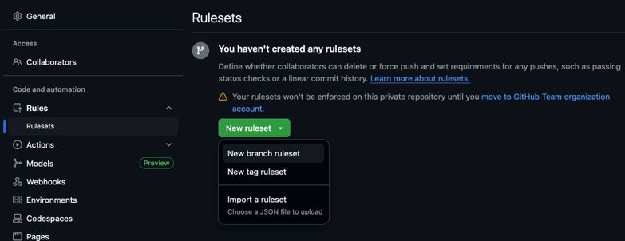
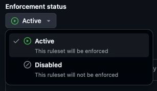
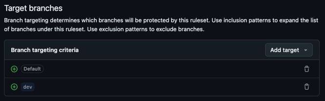
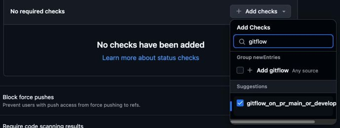
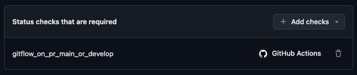

# But

Ce dossier contient des Github Actions réutilisables facilitant la mise en oeuvre du GitFlow dans les dépôts de code du CQEN (mais notez que ces actions sont assez agnostiques pour être utilisées en dehors du CQEN)

> Note sur les noms des branches : `main`, `master` et `prod` sont synonymes. `develop` et `dev` sont synonymes. Ils sont interchangeables, mais dans un même dépôt, il faut faire un choix et toujours utiliser les mêmes valeurs.

## Comment utiliser le gitflow dans votre projet

Voici les étapes, au CQEN, pour créer un dépôt de code et l'initialiser de sorte qu'il implémente adéquatement le _GitFlow_ et la bonne stratégie de versionnage.

TL;DR, voici un résumé des étapes
1. Créer le dépôt sur Github
   1. Spécifier la licence LiLiQ-R (TODO)
2. Renommez la branche par défaut à `main` (si ce n'est pas déjà le cas)
3. Cloner localement la branche `main`
4. Créer les fichiers
    - `.github/workflows/gitflow_create_version.yml`
    - `.github/workflows/gitflow_valider_pr.yml`
    - `./GitVersion.yml`
5. `commit` et `push` vers Github
6. Créer la branche `dev` (basée sur `main`)
7. Pousser la branche `dev` vers GithHub
9. Créer les restrictions sur les branches.


### 1. Créer un dépôt et définir les deux branches principales

- Créez un nouveau dépôt de code.
  - La branche créée par défaut devrait être nommée `main`. Vous pouvez changer son nom à `master` ou `prod`, mais `main` est généralement reconnu comme la branche principale d'un dépôt implémentant le GitFlow.
- Ajouter la licence LiLiQ-R
> ⚠️ TODO : Ajouter la procédure pour ajouter la licence.


### 2. Cloner le repo localement

Clonez le repo en pointant sur la branche `main` (ou *develop*, selon votre choix à l'étape précédente).

```sh
git clone [url_repo]
```

Vous pourrez pousser le code directement dans cette branche, avant que les restrictions ne soient appliquées (ces restrictions seront mises en place en tout dernier).

### 3. Créer les fichiers

#### Un workflow pour générer les versions

Créer un nouveau workflow sous `.github/workflows/` (le nom n'a pas d'importance). Copiez le code suivant (en adaptant les nom des branches `main` et `dev` si requis) :

```yaml
# .github/workflows/gitflow_create_version.yml

name: "Créer le tag de version"
on:
  push:
    branches:
      - feature/*
      - release/*
      - hotfix/*
      - main
      - dev
jobs:
  get_semver_version:
    name: Calculer la version et appliquer le tag
    runs-on: ubuntu-latest
    permissions:
      pull-requests: read
      contents: write
    steps:
    - name: Checkout
      uses: actions/checkout@v4

    - name: Obtenir version
      id: obtenir_version
      uses: MCN-CQEN/ceai-cqen-scripts-lib/actions/gitflow/get-semver 
      # FIXME : ⚠️ Ce lien ne fonctionnera pas tant que la PR ne sera pas mergée : en attendant, utiliser le lien MCN-CQEN/ceai-cqen-scripts-lib/tree/feature/actions-gitflow/actions/gitflow/get-semver
      
    - name: Créer le tag
      id: creer_tag
      uses: MCN-CQEN/ceai-cqen-scripts-lib/actions/gitflow/create-version-tag 
      # FIXME : ⚠️ Ce lien ne fonctionnera pas tant que la PR ne sera pas mergée : en attendant, utiliser le lien MCN-CQEN/ceai-cqen-scripts-lib/tree/feature/actions-gitflow/actions/gitflow/create-version-tag
      with:
        semVer: ${{ steps.obtenir_version.outputs.semVer }}
```

Explications : 
1. Le workflow sera activé par un push sur une des branches spécifiées (`feature/*`, `release/*`, `hotfix/*`, `prod`, `dev`).
2. Les permissions sont octroyées pour, entre autres, permettre à l'action de créer des tags de version.
3. L'action commune `get-semver` est appelée pour calculer la prochaine version
4. Le tag est créé basé la version établie à l'étape précédente.


#### Un workflow pour valider les PR

Créer un nouveau workflow sous `.github/workflows/` (le nom n'a pas d'importance) :

```yaml
# .github/workflows/gitflow_valider_pr.yml

name: "Validation du PR sur main ou develop"
on:
  pull_request:
    types: [opened, synchronize, reopened, edited]
jobs:
  gitflow_on_pr_main_or_develop:
    runs-on: ubuntu-latest
    steps:
      - name: Checkout
        id: checkout
        uses: actions/checkout@v4
        
      - name: Validation du PR
        id: valider_pr
        uses: MCN-CQEN/ceai-cqen-scripts-lib/actions/gitflow/validate-pr
        # FIXME : ⚠️ Ce lien ne fonctionnera pas tant que la PR ne sera pas mergée : en attendant, utiliser le lien MCN-CQEN/ceai-cqen-scripts-lib/tree/feature/actions-gitflow/actions/gitflow/validate-pr
        with:
          nom_branche_dest: ${{ github.base_ref }}
          nom_branche_source: ${{ github.head_ref }}
```

Explications :
1. Ce workflow est activé sur **tous** les *pull requests*.
2. L'action commune `validate-pr` est appelée :
   - On fourni le nom de branche source (`base`)
   - On fourni le nom de la branche de destination (`ref`) de la *pull request*.
3. Si la PR est possible (que les branche `base` et `ref` peuvent être fusionnées), alors l'action retourne un succès. Autrement, retourne un échec.


#### Fichier de configuration pour _GitVersion_

La librairie derrière le versionnage est [GitVersion](https://gitversion.net/). Si on ne spécifie aucun paramètre, elle prend pour acquis que nous souhaitons utiliser le _GitFlow_, et fournit une configuration par défaut qui convient bien à nos besoins, hormis la nomenclature de nos branches et certains de nos tags. Il est donc important de créer le fichier de configuration de _GitVersion_ `./GitVersion.yml` à la racine du dépôt (jusqu'à preuve du contraire, le nom du fichier est "case insensitive", alors vous pouvez le nommer en miniscule si désiré).

```yaml
# ./GitVersion.yml

# L'option ci-dessous Initialisera le repo à la version 0.0.0
next-version: 0.0.0

workflow: GitFlow/v1
branches:
  main:
    regex: ^master$|^main$|^prod$
    label: ''
    
  develop:
    regex: ^dev(elop)?(ment)?$
    label: dev

  feature:
    regex: ^feature[\/-](?<BranchName>.+)
    label: 'feature-{BranchName}'

  release:
    regex: ^release[\/-](?<BranchName>.+)
    label: rc

  hotfix:
    regex: ^hotfix[\/-](?<BranchName>.+)
    label: 'hotfix-{BranchName}'
```

### 4. Commit et Push dans `main` 

Faites un *commit* de votre projet dans la branche `prod`, et ensuite poussez les changements vers le repo.

```sh
git add .
git commit -S -s -m "Ajout des workflows pour automatiser la création des étiquettes de version et la vérification des pull requests."
git push
```

### 5. Créer la branche dev et la pousser sur Github

Créez localement une nouvelle branche `dev` et poussez-la sur Github :

```sh
git checkout -b dev
git push --set-upstream origin dev
```

Pour le moment, les règles ne sont pas actives, donc il ne devrait pas y avoir de problème.

### 6. Si requis, nettoyer les `tags` créés automatiquement

> TODO : Ajouter la procédure pour supprimer les tags.


### 7. Créer les restrictions de branches :
Vous pouvez maintenant créer les protections sur les branches.

Pour se faire, allez dans les paramètres de votre dépôt, puis dans la section "Rules" (si vous n'avez pas accès à cette section, vous devez demander les accès nécessaires). 

1. Créer un ___ruleset___
    1. Cliquez sur "Rules" / "Rulesets".
    2. Cliquez sur "New ruleset" / "New branch ruleset".
       > 
2. Nommez votre règle *"Protection des pull request"*
3. Activez la règle en sélectionnant **Active** sous *Enforcement status*.
     > 
2. Ajoutez les branches `main` (*Default*) et `dev` comme *targets*.
     > 
3. Activez les options 
    1. *Restrict deletions*
    2. *Require a pull request before merging*
        - Sélectionnez `Merge` uniquement comme *Allow merge method* (à confirmer que c'est réellement requis)
    2. *Require status checks to pass*
        - Cliquez sur *Add checks* et rechercher le nom de la job contenue dans le workflow de validation des PR. 
            
            Attention : Ce n'est pas le nom du workflow lui-même, mais bien le nom de la job à l'intérieur du workflow. Si vous avez copié le flow `.github/workflows/gitflow_valider_pr.yml`, vous devriez avoir une job nommée `gitflow_on_pr_main_or_develop`.

            > 
            
            Après avoir fermé le menu, la job apparaîtra :
            > 
    3. *Block force pushes*

Sauvegardez le tout, et voilà ! Vos branches sont protégées.

