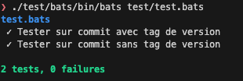

Si vous apportez des changements au script, il faut rouler les tests et, si requis, les mettre à jour.

Pour les rouler, il faut lancer la commande :

```sh
./test/bats/bin/bats test/test.bats
```


Voici le résultat attendu (peut être différent si de nouveaux tests on été ajoutés depuis la rédaction du présent fichier) :




Si vous obtenez une erreur, c'est peut-être parce que le clone du repo n'a pas les sous-modules initialisés ou mises à jour.

Lancer la commande suivante pour obtenir les sous-modules :
```sh
git submodule update --init --recursive
```

Pour en savoir plus sur la libraire de tests Bats : 
- https://github.com/bats-core/bats-core
- https://bats-core.readthedocs.io/en/stable/