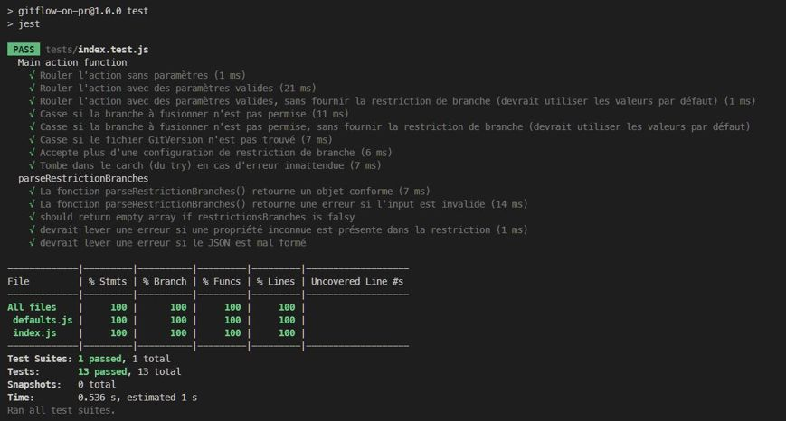

# Contribuer

Pour participer au développement de cette action, il faut pouvoir la tester localement (avec les tests unitaires) ainsi que sur Github.

## Pré-requis

Premièrement, il vous faudra un dépôt GitHub. Faites un fork du présent repo, ou un clone, et publiez-le dans un nouveau dépôt (si vous êtes un ou une contributeur.trice officiel.le, vous avec déjà un dépôt à votre disposition 😉).

> Selon le type de comptes GitHub à votre disposition, il se peut que vous ne puissiez pas tester le renforcement des règles lors des *pull_request* (les "status checks"). Pour que c'est règles soient appliquées, il faut que le dépôt soit publique, ou qu'il soit dans une équipe ou une organisation avec licence.

Ensuite, localement, il vous faudra :
- **node.js** version 20 ou plus (une version LTS idéalement) *
- **npm** version 10 ou plus (version utilisée au moment de rédiger ce document)

\* version utilisée par GitHub, voir dans le fichier `action.yml`

## Installer les dépendance

Assurez-vous d'avoir Vercel NCC et ensuite installer les dépendances : 

```shell
npm i -g @vercel/ncc
npm install
```

## Tester les modifications

Si des modifications sont apportées à la fonction, il faut rouler les tests unitaires pour s'assurer que l'action fonctionne correctement, selon les spécifications.

```shell
npm test
```

## Compiler avant de pousser (***important***)

Après avoir roulé les tests unitaires, vous devrez compiler à nouveau le package avant d'archiver et pousser les changements vers GitHub. Voici les instructions pour le compiler de nouveau.

```shell
npm run package
```

La version compilée de l'action sera déposée sous `/actions/validate-pr/dist`. Ce dossier **doit être archivé**, il est donc normal qu'il ne soit pas exclu par le fichier `.gitignore`.

# Annexes

## Résultat des tests unitaires

Si tout s'est bien passé, vous devriez voir un compte rendu de test, comme par exemple : 


